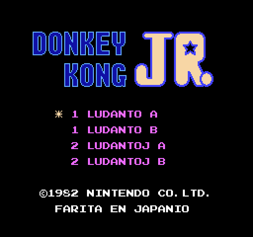
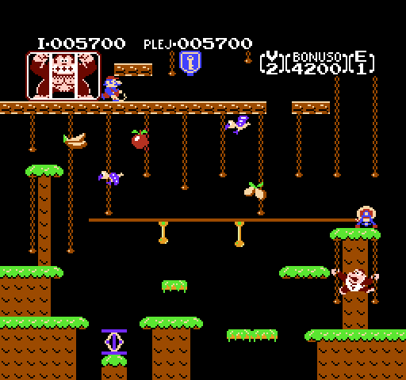
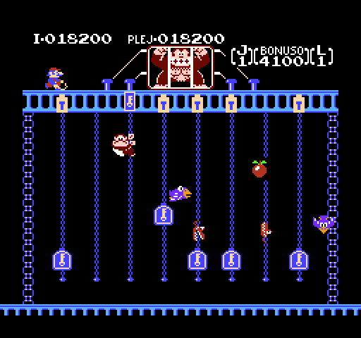
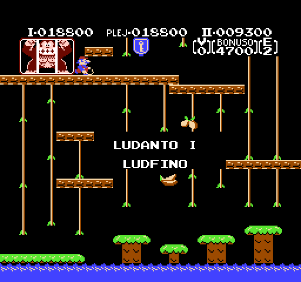

# Donkey Kong Jr.

_Legu
[donkeykongjr-readme.txt](donkeykongjr-readme.txt) por esperanta
priskrbo._

This project is a fan translation of
[Donkey Kong Jr.](https://en.wikipedia.org/wiki/Donkey_Kong_Jr.),
a video game for the Nintendo Entertainment System, to Esperanto.
All copyrights on the original game belong to Namco and Nintendo.

You *must* own a physical copy of the Donkey Kong Jr. cartridge.
Downloading the ROM of any game which you do not own may be
considered piracy.

  * Donkey Kong Jr. (World) (Rev A) - CRC32 `2A794CCB`

## Screenshots

Here are some pretty screenshots:

